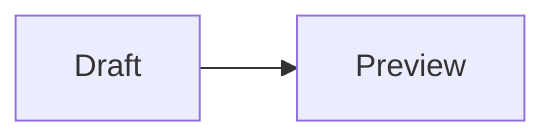

# Scratchpad

A minimalist custom notepad with markdown and bbcode support.

Scratch block previews use the official `scratchblocks` 3.7.1 package.
Mermaid support uses `@mermaid-js/tiny` 12.0.0 with strict rendering enabled.

## Running It

You can find the installer in the releases section, but read if you want to edit the source. 

Use Node.js 26.3.1, then install and start the Electron app:

```powershell
npm install
npm start
```

If npm reports that Electron's build script was skipped, approve the pkg and install it again. If errors appear, `npm audit fix --force` might fix the issue.

To create a Windows installer, run:

```powershell
npm run dist
```

## Custom Icons

The `icon_256.png` is the fallback icon. Add an icon set under `assets/icons` (see its README and `icons.json`) to customize the app plus the `.txt`, Markdown, and BBCode file-type icons. The distribution script prepares those icons before packaging.

## Scratch Blocks

ScratchBlocks can span lines and accept a style in the opening tag. For example, in BBCode, `[scratchblocks=scratch2]` or `[scratchblocks=scratch3]` can wrap a multi-line Scratch script, ending with `[/scratchblocks]`. In Markdown, type `scratchblocks scratch2` after the opening of a code block.

## Images and Diagrams

Use standard Markdown images, for example
``, or BBCode images such as `[img]https://example.com/image.png[/img]`. HTTP(S), local `file:` URLs, and common image data URLs are accepted; other schemes are rejected.

Put Mermaid in a fenced Markdown block:

````markdown

````

The source remains editable in Live Preview and the diagram appears below it;
Preview view shows only the completed diagram.
